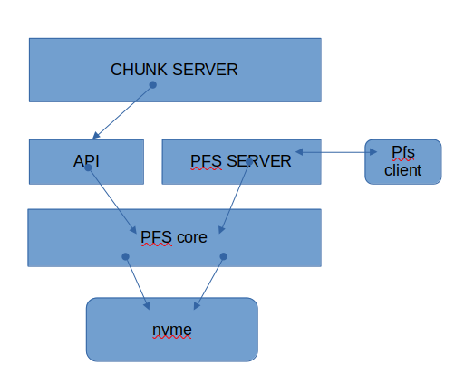

# CurveBS Direct Access NVME

## 问题和目的
当前CurveBS的IO由两种硬件承担，一是网卡做数据传输，另外一个是SSD存取数据。CurveBS在
支持数据库等需要低时延的场合，依然有提升的空间。
对于网卡，已经有RDMA，在通讯框架中原生支持RDMA,可以旁路掉CPU拷贝数据，进而获得网络加速。
而对盘的存取，则现有技术是使用INTEL公司的SPDK直接存取NVME, 避免CPU对数据拷贝。

本文是为了解决CHUNK SERVER磁盘存取的时延问题。

## 设计思路
直接存取NVME，需要存取硬件的软件接口，当前开源比较成熟的工具是INTEL SPDK，而是SPDK又是基于
DPDK。
DPDK提供大页内存管理和硬件设备探测与支持。
SPDK提供对各种存储硬件的支持，NVME是其中之一。

有了硬件存取接口，还需要有数据组织能力，CHUNK SERVER原来使用Ext4文件系统来组织数据，由于
内核文件系统只能运行于内核，不能运行于用户态的SPDK。手头比较熟悉的是PFS用户态文件系统，用来组织
CHUNK SERVER的数据应该足够，因为CHUNK SERVER的数据组织并不复杂。

PFS此前我们已经写过curve驱动，现在为其提供nvme驱动。
并为其添加DMA接口，当CHUNK SERVER有了DMA内存，从网卡接受到数据后，就可以通过DMA方式直接
写入NVME, 此举旁路掉了os, 也旁路掉了cpu数据拷贝。

## 准备工作
### 安装依赖包
这些包被DPDK和SPDK所需要
```
  apt install meson
  apt install ninja
  apt install elftools
  apt install python-pyelftools
  apt install python3-pyelftools
  apt install uuid-dev
  apt install libaio-dev
  apt install libcunit1-dev
  apt install libblkid-dev
  apt install libnuma-dev
  apt install libisal-dev
  apt install isal
  apt install libnuma-dev
  apt install libpcap-dev

  apt install python3-pip
  #ln -s python3 python // 设置缺省为python3

  pip install setuptools
  pip install meson
  apt install elftools
  apt install python3-pyelftools
  apt install apt-file
  apt install libisal-dev
  apt install libnuma-dev
  apt install libbsd-dev
  apt install pkg-config
```

### 安装DPDK

```
git clone git@github.com:DPDK/dpdk.git
cd dpdk
git checkout v22.03
meson --prefix=/usr/local/dpdk
cd build
ninja
sudo meson install
```

### 安装SPDK

```
git clone git@github.com:spdk/spdk.git
cd spdk
git checkout v22.01.x
./configure --prefix=/usr/local/spdk
make
sudo make install
```

### 安装PFS FOR NVME

```
git clone git@github.com:opencurve/PolarDB-FileSystem.git
cd PolarDB-FileSystem
git checkout nvme
mkdir build
cd build
ccmake ..
  以上TUI命令界面中设置DPDK和SPDK路径
make
make package
sudo dpkg -i pfsd-e81e11b-2.1.2-x86_64.deb
```

### 设置SPDK环境
DPDK和是SPDK使用大页内存，LINUX缺省大页内存非常少，可以通过下列命令来设置:

```
echo 1024 > /sys/devices/system/node/node0/hugepages/hugepages-2048kB/nr_hugepages
echo 1024 > /sys/devices/system/node/node1/hugepages/hugepages-2048kB/nr_hugepages
```

对于有2个以上节点的NUMA机器，需要把所有的节点都设置好，建议设置比较对的内存，以上每个NODE
1024个2M依然太小了，如果CHUNK SERVER有多个，需要设置更多的大页内存。

接下去，绑定SPDK驱动到NVME设备:

```
cd spdk
scripts/setup.sh status

root@prit1-curve-chunk-node20:/home/yfxu/github/spdk# scripts/setup.sh status
Hugepages
node     hugesize     free /  total
node0   1048576kB        0 /      0
node0      2048kB     1024 /   1024
node1   1048576kB        0 /      0
node1      2048kB        0 /      0
node2   1048576kB        0 /      0
node2      2048kB        0 /      0
node3   1048576kB        0 /      0
node3      2048kB        0 /      0
node4   1048576kB        0 /      0
node4      2048kB        0 /      0
node5   1048576kB        0 /      0
node5      2048kB        0 /      0
node6   1048576kB        0 /      0
node6      2048kB        0 /      0
node7   1048576kB        0 /      0
node7      2048kB        0 /      0

Type     BDF             Vendor Device NUMA    Driver           Device     Block devices
NVMe     0000:81:00.0    144d   a80a   4       nvme             nvme5      nvme5n1
NVMe     0000:82:00.0    144d   a80a   4       nvme             nvme2      nvme2n1
NVMe     0000:83:00.0    144d   a80a   4       nvme             nvme7      nvme7n1
NVMe     0000:84:00.0    144d   a80a   4       nvme             nvme0      nvme0n1
NVMe     0000:c1:00.0    144d   a80a   6       nvme             nvme4      nvme4n1
NVMe     0000:c2:00.0    144d   a80a   6       nvme             nvme1      nvme1n1
NVMe     0000:c3:00.0    144d   a80a   6       nvme             nvme3      nvme3n1
NVMe     0000:c4:00.0    144d   a80a   6       nvme             nvme6      nvme6n1
```

绑定：
```
root@prit1-curve-chunk-node20:/home/yfxu/github/spdk# scripts/setup.sh
0000:81:00.0 (144d a80a): nvme -> vfio-pci
0000:c3:00.0 (144d a80a): nvme -> vfio-pci
0000:c4:00.0 (144d a80a): nvme -> vfio-pci
0000:83:00.0 (144d a80a): nvme -> vfio-pci
0000:82:00.0 (144d a80a): nvme -> vfio-pci
0000:84:00.0 (144d a80a): nvme -> vfio-pci
0000:c2:00.0 (144d a80a): nvme -> vfio-pci
0000:c1:00.0 (144d a80a): nvme -> vfio-pci
```

## 运行

###  初始化PFS文件系统

对位于PCIe 0000:81:00.0的NVME设备的namespace 1初始化：

```
bin/pfs -K '0000:81:00.0' -C spdk mkfs -f '0000:81:00.0n1'
```

```
bin/pfs -K '0000:81:00.0' -C spdk mkfs -f '0000:81:00.0n1'
pfs tool cmd record:mkfs -f 0000:81:00.0n1
[PFS_LOG] May 26 15:38:56.414026 INF [129089] pfs build version:libpfs_version_("pfsd-build-desc-e448f41-2022年 05月 26日 星期四 14:44:24 CST")
[PFS_LOG] May 26 15:38:56.414170 INF [129089] pid: 122899, caller: bash
[PFS_LOG] May 26 15:38:56.414283 INF [129089] pid: 122898, caller: sudo bash
[PFS_LOG] May 26 15:38:56.414369 INF [129089] pid: 19884, caller: -bash
[PFS_LOG] May 26 15:38:56.414412 INF [129089] pid: 19883, caller: sshd: yfxu@pts/0
[PFS_LOG] May 26 15:38:56.414454 INF [129089] pid: 19877, caller: sshd: yfxu [priv]
[PFS_LOG] May 26 15:38:56.414493 INF [129089] pid: 2847, caller: /usr/sbin/sshd -D
[PFS_LOG] May 26 15:38:56.414546 INF [129089] open device cluster spdk, devname 0000:81:00.0n1, flags 0x13
[PFS_LOG] May 26 15:38:56.414762 INF [129089] generated json config file: /tmp/pfs_spdk_json_config_VdMkkm
[2022-05-26 15:38:56.414846] Starting SPDK v22.01.2-pre git sha1 4c7d5ef45 / DPDK 22.03.0 initialization...
[2022-05-26 15:38:56.414927] [ DPDK EAL parameters: [2022-05-26 15:38:56.414951] spdk [2022-05-26 15:38:56.414969] --no-shconf [2022-05-26 15:38:56.414988] -l 0-127 [2022-05-26 15:38:56.415004] --log-level=lib.eal:6 [2022-05-26 15:38:56.415025] --log-level=lib.cryptodev:5 [2022-05-26 15:38:56.415043] --log-level=user1:6 [2022-05-26 15:38:56.415059] --iova-mode=pa [2022-05-26 15:38:56.415077] --base-virtaddr=0x200000000000 [2022-05-26 15:38:56.415096] --match-allocations [2022-05-26 15:38:56.415114] --file-prefix=spdk_pid129089 [2022-05-26 15:38:56.415132] ]
EAL: No free 2048 kB hugepages reported on node 1
EAL: No free 2048 kB hugepages reported on node 2
EAL: No free 2048 kB hugepages reported on node 3
EAL: No free 2048 kB hugepages reported on node 4
EAL: No free 2048 kB hugepages reported on node 5
EAL: No free 2048 kB hugepages reported on node 6
EAL: No free 2048 kB hugepages reported on node 7
TELEMETRY: No legacy callbacks, legacy socket not created
[PFS_LOG] May 26 15:38:56.711316 INF [129089] json config file: /tmp/pfs_spdk_json_config_VdMkkm
[PFS_LOG] May 26 15:38:56.711350 INF [129089] spdk rpc address:/var/tmp/spdk.sock
[2022-05-26 15:38:56.711901] accel_engine.c: 510:spdk_accel_engine_initialize: *NOTICE*: Accel engine initialized to use software engine.
[PFS_LOG] May 26 15:38:57.045653 INF [129089] Found devices:
[PFS_LOG] May 26 15:38:57.045674 INF [129089]    Name: 0000:81:00.0n1, Size: 1920383410176
[PFS_LOG] May 26 15:38:57.045951 INF [129222] device 0000:81:00.0n1, current pci address 0000:81:00.0
[PFS_LOG] May 26 15:38:57.046681 INF [129222] open spdk device: '0000:81:00.0n1', block_num: 3750748848, block_size: 512, write_unit_size: 1, has_cache: 0
[PFS_LOG] May 26 15:38:57.047207 INF [129089] pfs_spdk_dev_info get pi_pbdno 0, pi_rwtype 1, pi_unitsize 4194304, pi_chunksize 10737418240, pi_disksize 1911260446720
[PFS_LOG] May 26 15:38:57.047225 INF [129089] pfs_spdk_dev_info waste size: 9122963456
[PFS_LOG] May 26 15:38:57.047233 INF [129089] disk size 0x1bd00000000, chunk size 0x280000000
[PFS_LOG] May 26 15:38:57.047666 INF [129089] mkfs runs forcedly, although PBD 0000:81:00.0n1 chunk 0 is already formatted
...
Init chunk 0
                metaset        0/1: sectbda           0x1000, npage       80, objsize  128, nobj 2560, oid range [       0,      a00)
                metaset        0/2: sectbda          0x51000, npage       64, objsize  128, nobj 2048, oid range [       0,      800)
                metaset        0/3: sectbda          0x91000, npage       64, objsize  128, nobj 2048, oid range [       0,      800)

Init chunk 1
                metaset        1/1: sectbda      0x280001000, npage       80, objsize  128, nobj 2560, oid range [    1000,     1a00)
                metaset        1/2: sectbda      0x280051000, npage       64, objsize  128, nobj 2048, oid range [     800,     1000)
                metaset        1/3: sectbda      0x280091000, npage       64, objsize  128, nobj 2048, oid range [     800,     1000)
...
inited filesystem(1911260446720 bytes), 178 chunks, 2560 blktags, 2048 direntries, 2048 inodes per chunk
making paxos file
init paxos lease
making journal file
pfs mkfs succeeds!
```

### 启动PFS daemon
```
bin/pfsdaemon -pbd_name='0000:81:00.0n1' --spdk_nvme_controller='0000:81:00.0' --pfs_spdk_driver_auto_cpu_bind=0 --workers=60
```

在另外一个终端查看LOG:
```
vi /tmp/pfsdaemon.INFO
```

```
Log file created at: 2022/05/26 15:42:45
Running on machine: prit1-curve-chunk-node20.jd.163.org
Log line format: [IWEF]mmdd hh:mm:ss.uuuuuu threadid file:line] msg
I 2022-05-26T15:42:45.138752+0800 132046 pfsd.cc:73] starting pfsd[132046] 0000:81:00.0n1
I 2022-05-26T15:42:45.139022+0800 132046 pfs_spdk.cc:235] generated json config file: /tmp/pfs_spdk_json_config_tU9Uk7
W 2022-05-26T15:42:45.139096+0800 132046 <spdk>:1] Starting SPDK v22.01.2-pre git sha1 4c7d5ef45 / DPDK 22.03.0 initialization...
W 2022-05-26T15:42:45.139117+0800 132046 <spdk>:1] [ DPDK EAL parameters:
W 2022-05-26T15:42:45.139127+0800 132046 <spdk>:1] spdk
W 2022-05-26T15:42:45.139135+0800 132046 <spdk>:1] --no-shconf
W 2022-05-26T15:42:45.139144+0800 132046 <spdk>:1] -l 0-127
W 2022-05-26T15:42:45.139151+0800 132046 <spdk>:1] --log-level=lib.eal:6
W 2022-05-26T15:42:45.139159+0800 132046 <spdk>:1] --log-level=lib.cryptodev:5
W 2022-05-26T15:42:45.139168+0800 132046 <spdk>:1] --log-level=user1:6
W 2022-05-26T15:42:45.139176+0800 132046 <spdk>:1] --iova-mode=pa
W 2022-05-26T15:42:45.139184+0800 132046 <spdk>:1] --base-virtaddr=0x200000000000
W 2022-05-26T15:42:45.139192+0800 132046 <spdk>:1] --match-allocations
W 2022-05-26T15:42:45.139199+0800 132046 <spdk>:1] --file-prefix=spdk_pid132046

```

### 开发
PFS daemon只是用来验证用的。CHUNK SERVER不使用pfsdaemon，但是用api启动PFS模块：

chunk server 直接调用 pfs api， 而不是通过pfsd client模块再通过SHM 通道去操作，这和数据库是不同的。



具体过程:
```
#include<pfsd.h>
#include<err.h>
#include<pfs_api.h>

chunk_server()
{
    int rc;

    rc = pfsd_start(true);
    if (rc) {
      errx(1, "pfsd_start failed");
    }

    // mount 文件系统
    rc = pfs_mount_acquire("spdk", "0000:81:00.0n1", 1, PFS_RDWR|MNTFLG_PFSD_INTERNAL);
    if (rc) {
      errx(1, "pfs_mount_acquire failed");
    }

    int fd = pfs_open("/0000:81:00.0n1/chunk_1", O_CREAT|O_RDWR, 0600);
    if (fd == -1) {
      err(1, "can not open file");
    }

    char buf[10];
    strcpy(buf, "hello");
    pfs_write(fd, buf, 5);

    // 分配可以直接DMA的buffer
    char *p = (char *)rte_malloc_socket("", 4096, 16, SOCKET_ANY_ID);   
    strcpy(p, "world");
    pfs_write_dma(fd, p, 5);
    rte_free(p);
    pfs_close(fd);
    pfs_mount_release("0000:81:00.0n1", 1);
    return 0;
}
```
### 性能调优

PFS SPDK驱动内部使用一个忙等待的io线程，这个线程最好是绑定到与对应的NVME所在的
pci设备位置最近的CPU上。

#### 两种方式:

1. PFS SPDK驱动能自动识别对应的NVME设备位于什么总线位置，并根据LINUX提供的topo架构
计算cpu_set_t掩码，并自动绑定到这个cpu集合上。
用gflags 命令行参数激活：
  -pfs_spdk_driver_auto_cpu_bind=1

2. 另外一种是使用LINUX cpu隔离

在例如我们需要操作的nvme离cpu id 32比较近，可以在 linux kernel 启动选项上加入:
 isolcpus=32 

```
vi /etc/default/grub

GRUB_CMDLINE_LINUX_DEFAULT="net.ifnames=0 biosdevname=0 quiet cgroup_enable=memory crashkernel=512M isolcpus=32"

update-grub
```
重新启动linux即可。

然后把线程绑定, 命令行参数:
 -pfs_spdk_driver_cpu_bind='0000:81:00.0n1@32'

此后，cpu 32被我们的SPDK IO线程独占, 不再受调度干扰。

### 后续

后续需要修改BRPC, 申请DMA BUF,直接把数据网络来的数据进入DMA buf，然后通过pfs_write_dma,
pfs_pwrite_dma写入NVME.
